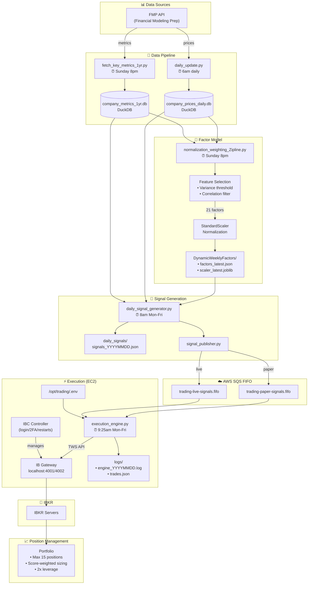

```markdown
# Lodon Trading System Architecture


```mermaid

flowchart TB
    subgraph DataSources["📊 Data Sources"]
        FMP["FMP API<br/>(Financial Modeling Prep)"]
    end

    subgraph DataPipeline["💾 Data Pipeline"]
        direction TB
        PricesDB[(company_prices_daily.db<br/>DuckDB)]
        MetricsDB[(company_metrics_1yr.db<br/>DuckDB)]
        DailyUpdate["daily_update.py<br/>⏰ 6am daily"]
        FetchMetrics["fetch_key_metrics_1yr.py<br/>⏰ Sunday 8pm"]
    end

    subgraph FactorModel["🧠 Factor Model"]
        direction TB
        Backtest["normalization_weighting_Zipline.py<br/>⏰ Sunday 8pm"]
        FeatureSelect["Feature Selection<br/>• Variance threshold<br/>• Correlation filter"]
        Scaler["StandardScaler<br/>Normalization"]
        FactorArtifacts["DynamicWeeklyFactors/<br/>• factors_latest.json<br/>• scaler_latest.joblib"]
    end

    subgraph SignalGen["📡 Signal Generation"]
        direction TB
        DailySignalGen["daily_signal_generator.py<br/>⏰ 8am Mon-Fri"]
        SignalFiles["daily_signals/<br/>signals_YYYYMMDD.json"]
        SignalPub["signal_publisher.py"]
    end

    subgraph MessageQueue["☁️ AWS SQS FIFO"]
        PaperQ["trading-paper-signals.fifo"]
        LiveQ["trading-live-signals.fifo"]
    end

    subgraph Execution["⚡ Execution (EC2)"]
        direction TB
        ExecEngine["execution_engine.py<br/>⏰ 9:25am Mon-Fri"]
        IBGateway["IB Gateway<br/>localhost:4001/4002"]
        IBC["IBC Controller<br/>(login/2FA/restarts)"]
        EnvConfig["/opt/trading/.env"]
        TradeLogs["logs/<br/>• engine_YYYYMMDD.log<br/>• trades.json"]
    end

    subgraph Broker["🏦 IBKR"]
        IBKRServers["IBKR Servers"]
    end

    subgraph Positions["📈 Position Management"]
        Portfolio["Portfolio<br/>• Max 15 positions<br/>• Score-weighted sizing<br/>• 2x leverage"]
    end

    FMP -->|prices| DailyUpdate
    FMP -->|metrics| FetchMetrics
    DailyUpdate --> PricesDB
    FetchMetrics --> MetricsDB

    PricesDB --> Backtest
    MetricsDB --> Backtest
    Backtest --> FeatureSelect
    FeatureSelect -->|21 factors| Scaler
    Scaler --> FactorArtifacts

    FactorArtifacts --> DailySignalGen
    PricesDB --> DailySignalGen
    MetricsDB --> DailySignalGen
    DailySignalGen --> SignalFiles
    DailySignalGen --> SignalPub
    SignalPub -->|paper| PaperQ
    SignalPub -->|live| LiveQ

    PaperQ --> ExecEngine
    LiveQ --> ExecEngine
    EnvConfig --> ExecEngine
    ExecEngine -->|TWS API| IBGateway
    IBC -->|manages| IBGateway
    IBGateway --> IBKRServers
    ExecEngine --> TradeLogs

    IBKRServers --> Portfolio
```
